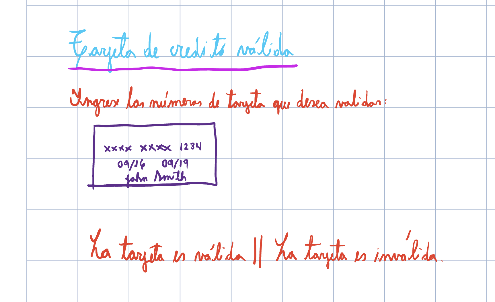
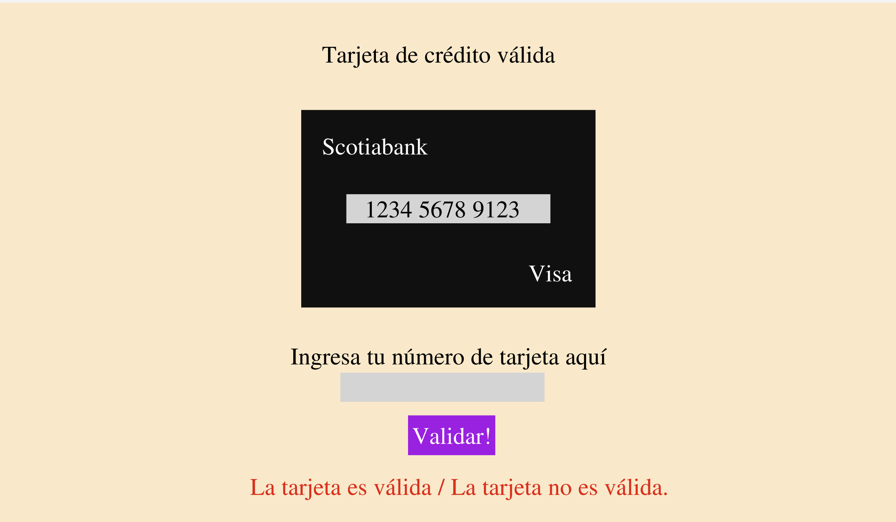
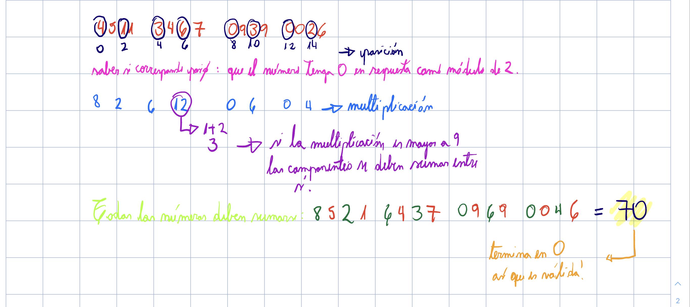

-Este proyecto se está realizando para poder leer valores numéricos de tarjetas de crédito y determinar si son válidos mediante el algoritmo de Luhn.
Se inició a partir de este diseño escrito a mano.

-No soy una experta en Figma, digamos que intenté plasmar este prototipo de la mejor forma que pude considerando que no lo conozco bien, más que nada basándome en el objetivo que quiero lograr con él.

-Dando este resultado base en diseño y apariencia.

-El algoritmo de Luhn funciona de la siguiente manera. Para crear esta explicación y probarla usé una tarjeta débito random que poseo:

Es decir, cada dos posiciones, empezando desde la inicial, que consideraríamos como 0, se debe multiplicar por dos el valor, si este valor da sobre 9, ambos dígitos se deben sumar. 
Luego, todos los números se deben sumar entre sí, y si la tarjeta es válida, el resultado de la suma debe ser un valor terminado en 0.

-Este programa se ejecuta ingresando los 16 números de tu tarjeta en el input indicado. Si este input no es correcto (por cantidad de números), se emitirá un mensaje impreso en pantalla pidiendo que revises lo ingresado y coloques exactamente los 16 números.

-Si todo resulta bien, revisará la tarjeta ingresada y la imprimirá dejando visibles sólo los últimos 4 dígitos. Y comprobará si es válida o no.
